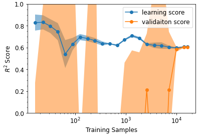
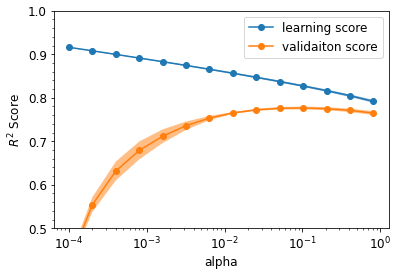
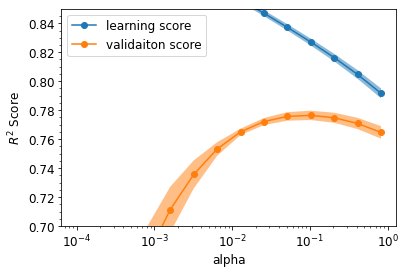
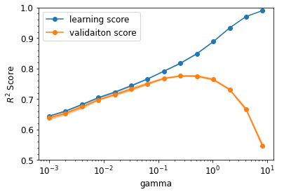
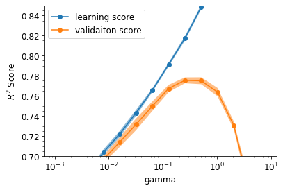
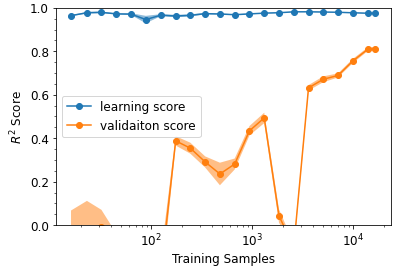
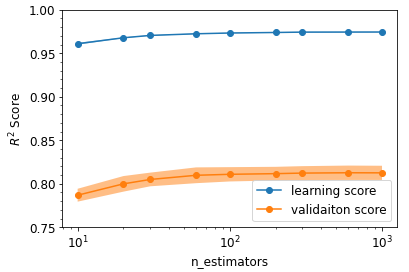
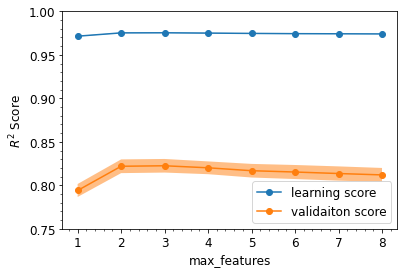

# 統計的機械学習レポート課題

所属：総合文化研究科広域科学専攻相関基礎科学系
学籍番号：31-217907
氏名：崎下雄稀

## 概要

本レポートでは，オープンソース機械学習scikit-learnで提供されているデータセット「California Housing dataset」を用いて住宅価格を予想するタスクを Kernel Ridge 法および Random Forest 法を用いて行い，ハイパーパラメータやデータ量による性能の変化を評価した．

## 手法

「California Housing dataset」を用いて Kernel Ridge 法および Random Forest 法で予測を行い，K-fold法で性能の評価を行った．学習，性能評価は Python ライブラリ scikit-learn (© 2007 - 2020, scikit-learn developers (BSD License)) を用いて行った．

### Data Set

本レポートで使用するデータセットは，住宅価格を含む9つの経済的指標が地区ごとに集計されたものである(R. K. Pace and R. Barry (1997))．各変数を以下に示す．

目的変数：

+ 住宅価格の中央値

特徴量：

+ 収入の中央値
+ 住宅の築年数の中央値
+ 住宅の部屋数の平均値
+ 住宅の寝室の数の平均値
+ 地区の人口
+ 住宅の占有率
+ 地区の経度
+ 地区の緯度

変数は全て実数，サンプル数は 20640 で，欠損値は含まれない．本データセットは「Boston house prices dataset」などと比べサンプル数が多く，実世界データセットとして提供されている．

### Kernel Ridge

Kernel Ridge 法は Ridge 回帰をカーネル空間で行うものである．

本実験ではRBFカーネルを使用する．ハイパーパラメータは正則化係数 `alpha` と，カーネル変数 `gamma` である．`alpha` は大きいほど正則化が強まるため，経験誤差は大きくなり汎化誤差との差は小さくなることが期待される． `gamma` はカーネル関数であるガウシアンRBF関数の幅に影響する．大きいほど表現力が上がるため，一定の`alpha` のもとでは相対的に正則化が弱まり過学習の傾向が強まることが予想される．
学習は入力データを正規化して行う．

### Random Forest

Random Forest 法はバイアスが小さくバリアンスが大きい決定木学習をアンサンブル学習によりバリアンスの減少を図る手法である．

本実験ではハイパーパラメータとして `n_estimator` と `max_features` を設定する．`n_estimator` はアンサンブルを行う木の数であり，多いほど性能が上がることが期待される．`max_features` は各決定木で用いる特徴量の最大数である．特徴量の数の制限は正則化と捉えることができ，小さいほど経験誤差は大きくなり汎化誤差との差は小さくなることが期待される．
Kernel Ridge 法と異なり，パラメータ間の大きさの違いは学習に影響を与えないため正規化は行わない．

### 性能の評価

予測モデルの性能の評価は K-fold 法を用いて行った．すなわち，データセットを $K$ 個に分割してそのうち1つを検証用データに，それ以外を学習データとして学習，テストを行いうことを $K$ 通り行い，それぞれの結果の平均値を見る方法である．

性能の評価は目的変数と予測値の $R^2$ 値で行った．以下学習データにおける $R^2$ 値を学習性能，検証用データにおける $R^2$ 値を検証性能と呼ぶ．

計算時間の都合により，Kernel Ridge 法では $K=3$ ，Random Forest 法では $K=5$ とした．また，学習サンプル数を変化させる場合は各分割のの後に一部を抽出した．

## 結果

### Kernel Ridge

図1は Kernel Ridge 法でサンプル数を13から13760まで変化させたときの学習性能・検証性能の推移を表したものである．これは全データから検証用データを除いた2/3の0.1%から100%まで変えたものである．
サンプル数が5000以下と少ない領域では極端にスコアの悪いものが含まれるためエラー領域が大きく上下しているが，概ねサンプル数を増やすと学習性能が下がり検証性能は上昇するという傾向が見られる．

図2は `alpha` を $10^{-4}$ から $1$ まで変化させたときの性能の推移である．`alpha` が大きくなるにつれ正則化が強まり，学習性能が低下する反面経験誤差と汎化誤差の差が小さくなり $10^{-1}$ 程度までは検証性能が上昇していることがわかる．

図3は `gamma` を $10^{-3}$ から $10$ まで変化させたときの性能の推移である． `gamma` が大きくなるほど学習性能が1に近づく一方検証性能は `gamma`$=0.5$ 程度を境に減少し始め，過学習していることがわかる．

 

 

### Random Forest

図4は Random Forest 法でサンプル数を16から16512まで変化させたときの性能の推移を表したものである．概ねサンプル数を増やすと学習性能が下がり検証性能は上昇するという傾向が見られる．

図5は `n_estimator` を10から1000まで変化させた時の性能の推移である．`n_estimator` を大きくすると学習性能・検証性能ともに上昇するが `n_estimator`$=100$ 程度で飽和しているという結果が得られた．

図6は `max_features` を1から8まで変化させた時の性能の推移である．`max_features`$=2$ で性能は最大値を示した．これはscikit-learnでのデフォルト値である特徴量数の平方根 $2\sqrt{2}$ と大きく変わらない．

## まとめ
