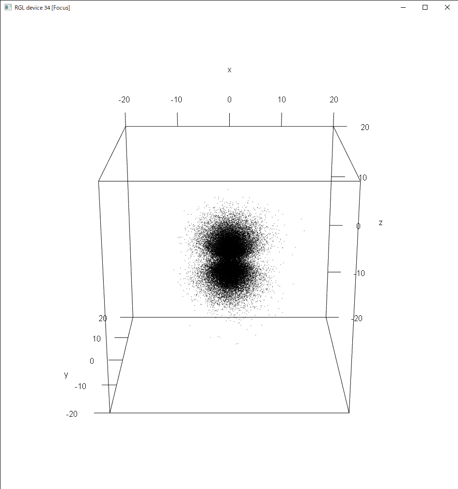

# 統計データ解析Ⅰ レポート課題

所属：総合文化研究科 広域科学専攻 相関基礎科学系 博士課程1年
氏名：崎下雄稀
学籍番号：31-217907

## 動機づけ

Markov chain Monte Carlo 法を用いて水素原子波動関数の確率分布関数に従う点をサンプリングし，波動関数の可視化を行った．

波動関数は多層構造を取り得るため等値平面をプロットするよりも，確率分布に従い点を多数プロットした雲状プロットの方がより多くの情報が得られ，波動関数の形状をより直感的に捉えられる．
ところが，確率分布関数は一般に複雑な関数形をとるため逆関数法や棄却法によるサンプリングは難しい．そこで，マルコフ連鎖を用いて確率変数を生成するアルゴリズムである Markov chain Monte Carlo 法を用いて確率シミュレーションにより，求めたい3次元乱数のサンプリングを行う．

## モデル化

### Metropolis法

ある確率分布が
$$
P(x)=\frac{\mathcal{L}(x)}{Z}
$$
と表されるとき，以下の手順に従い，適当に定めた $x_0$ から $x_1, x_2, \cdots$ を構成すると，十分大きな $n$ より大きい $i$ で $x_i$ は $P(x)$ に従う乱数となる．

+ $x_k$ が定まっているとき， $x'$ を各成分について一様乱数 $\mathrm{Unif}(x_k-c,x_k+c)$ から生成する
+ 確率 $\min\{1, \exp(\log\mathcal{L}(x') - \log\mathcal{L}(x_k))\}$ で $x_{k+1}=x'$ とし，それ以外では $x_{k+1}=x_k$ とする．

これは状態変数 $x$ 間の遷移確率を適切に設定することで $x$ の定常分布が $P(x)$ となるようにした Markov chain Monte Carlo 法の実装の1つ，Metropolis 法である．一般にMetropolis 法によるサンプリングは自己相関があり，サンプル同士の間隔を十分空けることでそれぞれ独立なサンプルとみなす．
以上の手順においては一様乱数のみを用いており，コンピューターシミュレーションにおいて一様乱数から任意の確率分布を得る手法として有用である．

$\log\mathcal{L}(x)=-\frac{x^2}2$ とすれば平均0，分散1の正規分布に従う乱数が得られる（`normal_distribution.R`）．

### 水素原子波動関数

水素原子における電子の波動関数 $\Psi$ はシュレディンガー方程式

```math
\left[-\frac{\hbar^2}{2\mu}\nabla^2-\frac{e^2}{4\pi\varepsilon_0|x|}\right]\Psi(x)=E\Psi(x)
```

の解である．これを極座標形式に変換し，方程式を解くと以下の解が得られる．

```math
\Psi(r, \theta, \phi)=N_{l,n}
\left(\frac{\rho}{n}\right)^l e^{-\frac{\rho}{n}} L_{n+l}^{2l+1}\left(\frac{\rho}{n}\right)
\times M_{l,m} P_l^{|m|}(\cos\theta)e^{im\phi}\\
\ \\
\rho=\frac{Z}{a_0}r,\; a_0=\frac{4\pi\varepsilon_0\hbar^2}{\mu e^2},
```

$l,m,n$ は量子数，$N_{l,n},\;M_{l,m}$ は規格化定数，$L_k^j(x)$ はラゲールの陪多項式， $P_k^j(x)$ はルジャンドルの陪多項式である．

ここで，ある座標点 $(x,y,z)$ で電子が観測される確率は $|\Psi(x,y,z)|^2dxdydz$ と表され，これを極座標形式で表すと $|\Psi(\rho, \theta, \phi)|^2 r^2\sin\theta\; d\rho d\theta d\phi$ となるから，規格化定数を除いた

```math
\mathcal{L}_{l,m,n}(\rho, \theta, \phi)= \left\{ \left(\frac{\rho}{n}\right)^l e^{-\frac{\rho}{n}} L_{n+l}^{2l+1}\left(\frac{\rho}{n}\right) P_l^{|m|}(\cos\theta)e^{im\phi} \right\}^2\rho^2\sin\theta
```

を用いて Markov chain Monte Carlo 法を適用すれば，量子数に応じた電子軌道からのサンプリングを行える．

例として，$2\mathcal{p}_z$ 軌道は

```math
\mathcal{L}_{1,0,1}(\rho, \theta, \phi) = \rho \exp\left(\rho\right) \cos^2\theta \times \rho^2\sin\theta
```

$4\mathcal{f}_{z(5z^2-r^2)}$ 軌道は

```math
\mathcal{L}_{3,0,4}(\rho, \theta, \phi) = \rho^6 \exp\left(\frac\rho2\right) \left(5\cos^3\theta -4\cos\theta \right)^2\times \rho^2\sin\theta
```

のように表される．

## シミュレーションの視覚化

前節の Metropolis 法を R で実装し，水素原子の電子軌道に応じた $(\rho, \theta, \phi)$ のサンプリングを行った．さらに極座標から直交座標に変換し空間座標のサンプルを得た．
$2\mathrm{p}_z$，$3\mathrm{p}_z$，$3\mathrm{d}_{zx}$，$4\mathrm{f}_{xyz}$，$4\mathrm{f}_{z(5z^2-r^2)}$ 軌道についてサンプルを $10^5$ 個生成し，10個ごとにrglパッケージを用いて3次元プロットを行ったのが以下の図である．

実行コードは`hydrogen_*.R`である．

<figure>
    <center>
        
        
        <figcaption> 2pz 軌道のプロット </figcaption>
    </center>
</figure>
<figure>
    <center>
    
    
    <figcaption> 3pz 軌道のプロット </figcaption>
    </center>
</figure>
<figure>
    <center>
    
    
    <figcaption> 3dzx 軌道のプロット </figcaption>
    </center>
</figure>
<figure>
    <center>
    
    
    <figcaption> 4fxyz 軌道のプロット </figcaption>
    </center>
</figure>
<figure>
    <center>
    
    
    <figcaption> 4fz5z3r 軌道のプロット </figcaption>
    </center>
</figure>

## 考察

量子数に対応した節（確率密度が0となる面）の存在や電子の広がりが視覚的かつ動的に観察できた．rglパッケージの3次元プロットによりプロットを回転させて見ることが可能であり，観察が容易である（添付ファイル`4fxyz_movie.mp4`参照）．

一方， Metropolis 法は次のサンプルを生成するときの一様分布の幅 $c$ を適切に設定しなければ自己相関が強くなりすぎることや，確率密度が低く遷移できない節を超えられず定常分布に収束しない場合があるといった問題がある．以下の図は $c$ を上記の1/100である0.01に設定した場合のシミュレーション結果で，ごく狭い領域で前のサンプルからの相関の影響を強く受け，求めたい分布が得られなかった例である．今回のように確率密度に節を保つ場合は特に定常分布へ収束しているかどうかの判定を適切に行うことが必要である．

<figure>
    <center>
    
    <figcaption> 提案分布の幅が不適切で自己相関が強すぎる場合 </figcaption>
    </center>
</figure>

## 参考文献

Markov chain Monte Carlo 法に関して：花田政範, 松浦荘 『ゼロからできるMCMC マルコフ連鎖モンテカルロ法の実践的入門』 講談社 (2020)．
水素原子波動関数の解に関して：同志社大学理工学部 機能分子・生命化学科 Webテキスト 物理化学Ⅳ https://www1.doshisha.ac.jp/~bukka/lecture/quantum/pc4/pc4_index.html
